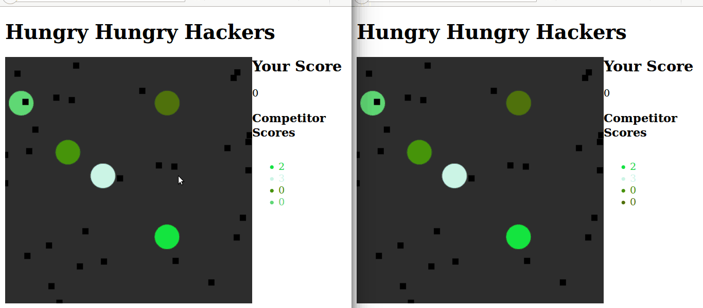

Code listing for a [tests4geeks.com](http://tests4geeks.com/blog)
post, in which a small multi-player browser game is built using [Meteor](https://meteor.com).  Here is what it looks like:



To run the sample, makes sure meteor is installed and do:

```bash
wget https://github.com/asciiascetic/commissioned/raw/master/rt-apps-meteor/hhh.tgz 
tar xvfz hhh.tgz
cd hhh
meteor npm install
meteor

```

Then navigate to [http://localhost:3000](http://localhost:3000) with
as many browsers as you can muster!

