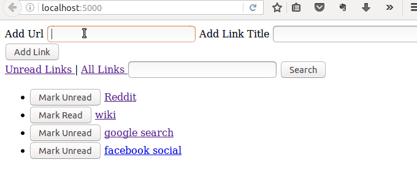

This directory contains the code listing for a
<<<<<<< HEAD
[tutorial](https://tests4geeks.com/tutorials/mongodb-tutorial-mongokat-pymongo/) 
=======
[tutorial](https://tests4geeks.com/tutorials/mongodb-tutorial-mongokat-pymongo/)
>>>>>>> tests4geeks
on [test4geeks.com](http://tests4geeks.com/blog) about using
[MongoDB](http://mongodb.org) in your Python projects. 

The code in this project directory defines a small bookmarking web app
called *bkmkr* built with [Flask](http://flask.pocoo.org/), and
showcasing the use of
[mongokat](https://mongokat.readthedocs.io/en/latest/) and
[pymongo](http://api.mongodb.org/python/current/).  It looks like
this:

