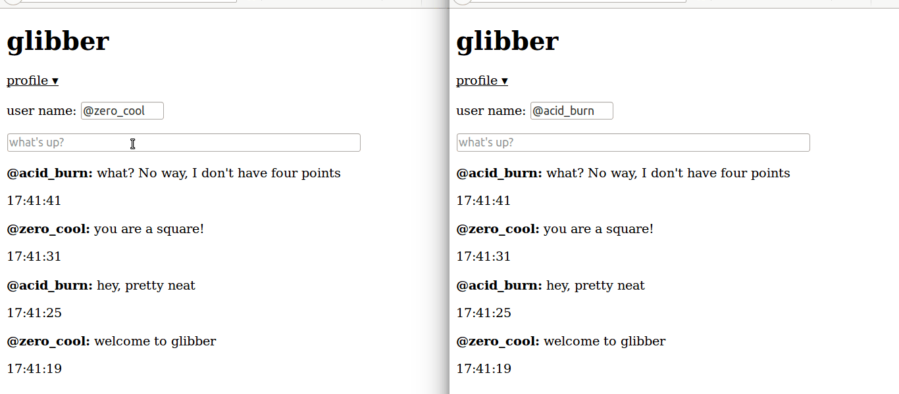

This directory contains the code listing for an
[article](https://tests4geeks.com/tutorials/getting-meteor-collections-hooks-helpers/) on [test4geeks.com](http://test4geeks.com/blog) on using [Meteor](http://meteor.com) collection helpers and hooks.

The code in this project directory implements an example microblogging
service called *Glibber*, and it looks like:

